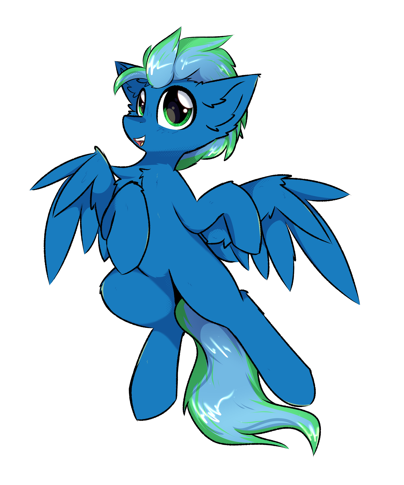

# 🦄 Hi, I'm Florian Metz (aka Timeraa)! 👋

## 📖 My Story

Greetings, fellow adventurers! I'm a 23-year-old DevOps developer from Germany, soaring through the clouds of code like a Pegasus on a mission. 🦄 My journey into the magical world of software development began when I was just a young colt, tinkering with Minecraft plugins and dipping my hooves into Java (though I've since galloped across various programming pastures).

As I spread my wings, I ventured into creating Discord bots, which lured me deeper into the enchanted forests of JavaScript and Node.js. But my true ascent into the stratosphere started when I conjured up [PreMiD](https://premid.app), a nifty little utility now cherished by over half a million active users! PreMiD lets you display your online escapades—like binge-watching Netflix shows—right on your Discord profile. This project didn't just launch me into new horizons; it also taught me to navigate the winds of frontend and backend development, infrastructure management, and the ever-changing weather of best practices.

## 🎓 Certifications

- 🏅 **Certified Mid-Level Vue.js Developer:** Proudly certified in Vue.js, crafting reactive and dynamic interfaces is my forte! [View Certificate](https://certificates.dev/c/9cc53f9a-64f2-4920-b773-8a08a684a7d5)

## 🌟 Hobbies

When I'm not coding up a storm, you might find me:

- 🎶 **Jamming to Music:** From epic soundtracks to indie beats, music helps this Pegasus find his rhythm.
- 🎮 **Gaming Adventures:** Exploring virtual worlds and embarking on quests that challenge my strategic thinking.
- 🏞️ **Hiking Trails:** Stretching my legs (and wings) in the great outdoors, conquering scenic trails.
- 🎢 **Thrill Seeker:** Riding roller coasters and embracing the adrenaline rush—who needs wings when you have gravity-defying rides?
- 🎬 **Animated Escapades:** Diving into the creative realms of Disney and other animation studios where storytelling truly takes flight.

## 🚀 What I Do

- 🔧 **DevOps & Medior Developer at [AutoflexBV](https://github.com/AutoflexBV):** Gaining altitude in the realms of software development and DevOps.

- 💼 **Co-founder & CEO at [Recodive oHG](https://recodive.com/):** We're passionately reinventing the wheel (because who says a Pegasus can't improve it?), pushing the boundaries of innovation and excellence.

## 💻 Technologies & Experiences

### 🔧 Programming Languages

### 🎨 Frontend Technologies

### 🛠️ Backend Technologies

### 🗄️ Databases

### 🌐 General

## 🛠️ Skills

- **Microservices Maestro:** Orchestrating microservices architectures to build scalable, modular applications that soar.

- **Container Connoisseur:** Expert in containerization with Docker, packaging applications and their dependencies into neat little bundles.

- **Orchestration Wizard:** Harnessing Kubernetes to deploy, scale, and manage containerized apps like a pro.

- **Linux Luminary:** Commanding Linux servers (Ubuntu FTW!) to ensure reliable and secure hosting environments.

- **Frontend Fanatic:** Crafting elegant interfaces with Vue.js and Nuxt.js that are as sleek as a Pegasus in flight.

- **Database Dynamo:** Wrangling data with MongoDB, PostgreSQL, and Redis (for that caching magic).

- **Message Broker Magician:** Making microservices communicate efficiently with RabbitMQ.

- **Project Management Pro:** Keeping projects on track with Jira, ensuring the journey is as smooth as gliding through clouds.

## 📫 Let's Connect

- 💬 **Reach Out:** Saddle up and drop me a message if you want to talk DevOps, software development, or share mythical tales!
- 📧 **Email:** [me@timeraa.dev](mailto:me@timeraa.dev)
- 🔗 **LinkedIn:** Connect with me on [LinkedIn](https://www.linkedin.com/in/Timeraa) for professional networking.
- 💬 **Discord:** Find me as **Timeraa**.

## ✨ Wrapping It Up

Thanks for fluttering by my GitHub profile! 🚀 If you like my code, give it a star ⭐️; if not, well, even Pegasi have off days! 😄

_P.S. A friendly AI might have sprinkled some magic dust on these words because, let's be honest, writing intros isn't my natural habitat. Thanks for understanding!_ 🤖🦄✨
